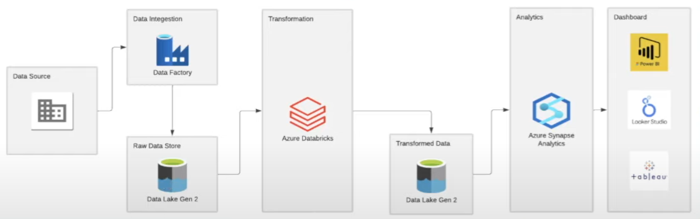

# Olympic-Data-analytics using Microsoft Azure

## Project Overview 

credits @darshilparmar
 

### About
This project focused on extracting data from Kaggle, our data source, then storing ingesting in Azure Gen2 Datalake. The data is transformed using Azure Databricks and then loaded to a new directory known as the transformed dataset in Azure Gen2 Datalake. 

### NextSteps
Run queries using Azure Synapse Analytics and then create a dashboard using PowerBi or Lookerstudio
